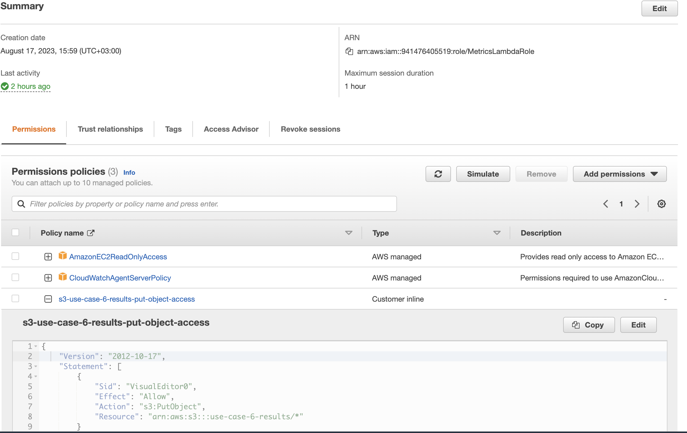
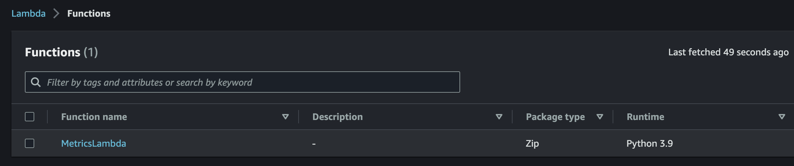
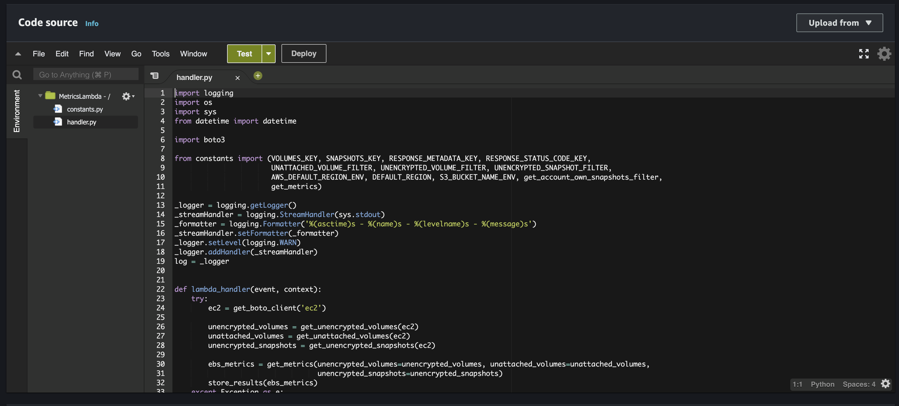
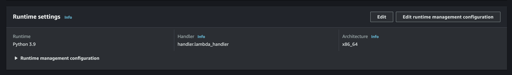
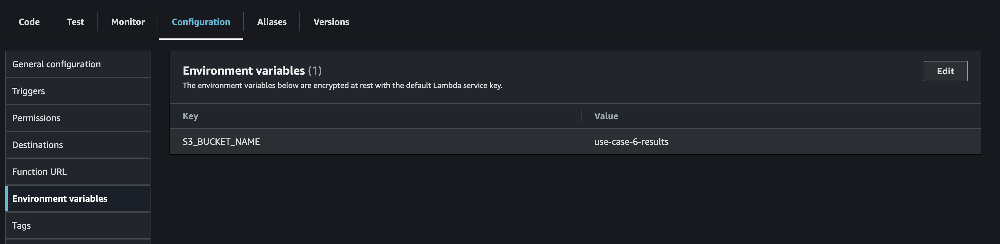
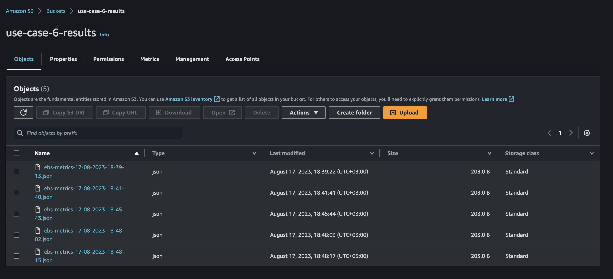
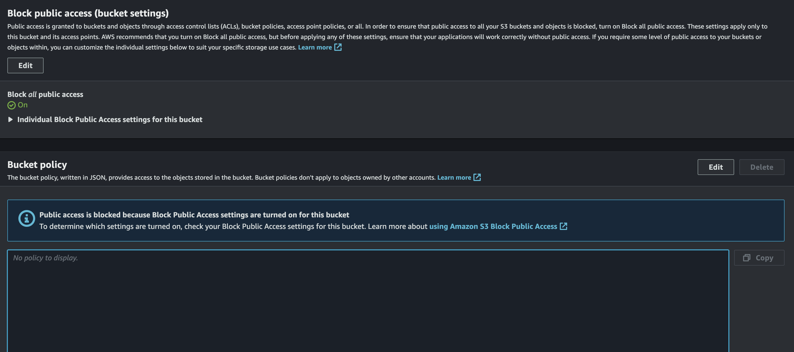
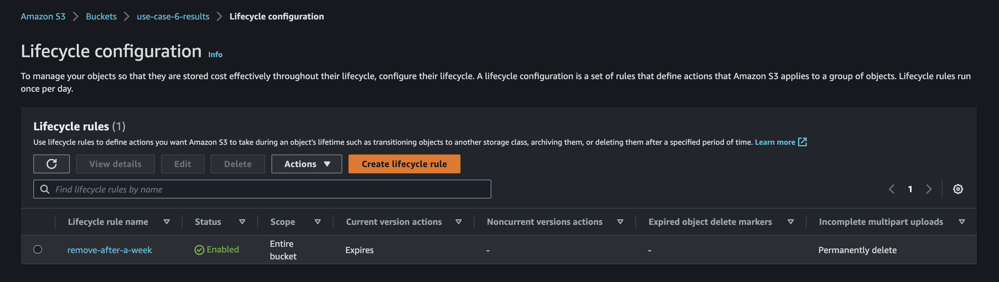
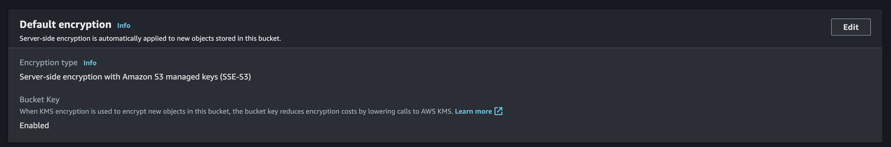

## Use case #6 - Provision and set up serverless infrastructure in cloud environments

### Development
* Initialize venv and install requirements ```pip install -r requirements.txt```
* Set the S3_BUCKET_NAME environment variable and AWS credentials
* Upload the Lambda code to AWS using upload-lambda-code.sh script: ```./upload-lambda-code.sh <LambdaFunctionName>```

### Use-case artifacts
[Example S3 output](readme-assets/ebs-metrics-17-08-2023-16-33-24.json)











